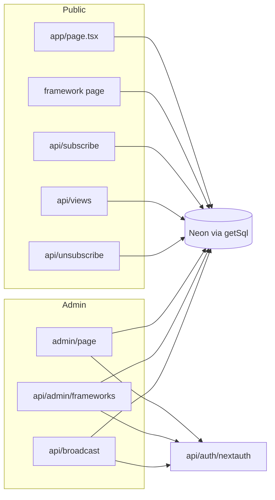

# Ground Work — session handoff (May 2026)

Use this doc to continue work in a new chat. **Do not edit** `.cursor/plans/*.plan.md` unless the user asks.

## Project

- **Repo:** `groundwork-ng` (Next.js 14 App Router, TypeScript)
- **Branch workflow:** work on `dev`, PR to `main`; user sometimes merges directly
- **Last pushed commit:** `b998e7b` on `origin/dev` — *feat: markdown reader, subscriber email opt-out, and mail stats*
- **Important:** A large **Neon + NextAuth migration** is implemented locally but **not committed or pushed** (see below).

---

## What happened in this chat (chronological)

### 1. Admin auth: magic link → username/password (then pushed)

- Replaced Supabase OTP magic link with env-based `ADMIN_EMAIL` + `ADMIN_PASSWORD` + client `signInWithPassword`.
- Removed magic-link callback/hash handling (`AuthHashFragmentHandler`, `/auth/callback/*`).
- **Still used Supabase Auth** for sessions at this stage.
- Pushed: `26b9652`, `6b1462a`, `b998e7b`.

### 2. Admin login debugging + login UX (partially pushed)

- **Why Vercel showed `POST /api/admin/request-login → 200` but login failed:** route always returns `{ ok: true, authorized: boolean }`; 200 ≠ success. Failure was often **step 2** — Supabase `signInWithPassword` when the Auth user was created via magic link **without a password**.
- **Fix for user:** recreate Supabase user with password, or set password in dashboard; align env + Supabase password.
- Added: “Back to site” link, password show/hide, README troubleshooting. Pushed in `6b1462a` / `b998e7b`.

### 3. Mobile filter toolbar CSS (pushed)

- `.fw-field { flex: 1 1 160px }` became **160px height** in column layout on small screens.
- Fix in `app/globals.css` `@media (max-width: 640px)`: `flex: 0 0 auto`, `flex-wrap: nowrap` on `.framework-toolbar`.

### 4. Markdown in framework reader (pushed)

- `react-markdown` + `remark-gfm` via `components/FrameworkMarkdown.tsx`.
- `FrameworkReader` renders full/lite content as Markdown (not plain text with literal `**` / `#`).
- Homepage cards still show `lite_content` as plain text (not markdown-rendered).

### 5. Subscriber email opt-out (pushed)

- DB columns: `receive_mail` (default `true`), `unsubscribe_token` (uuid).
- `GET /api/unsubscribe?token=…` sets `receive_mail = false`; row **stays** in `subscribers`.
- Broadcast only emails `receive_mail = true`; welcome/broadcast templates include unsubscribe link.
- Re-subscribe from homepage sets `receive_mail = true` again.
- Admin shows total subscribers + “N receiving email”.
- Schema migration SQL commented at bottom of old `supabase/schema.sql` (now superseded by `db/schema.sql`).

### 6. Supabase → Neon + NextAuth migration (**local only, not pushed**)

Full plan: `.cursor/plans/supabase_to_neon_nextauth_68150704.plan.md` (reference only).

**Completed in working tree:**

| Area | Change |
|------|--------|
| DB | `postgres` package, `lib/db.ts` (`getSql()` lazy init), `lib/db/frameworks.ts`, `lib/db/subscribers.ts`, `db/schema.sql` (no RLS) |
| Auth | `next-auth@4`, `lib/auth.ts` (Credentials), `lib/auth-credentials.ts`, `lib/require-admin.ts`, `app/api/auth/[...nextauth]/route.ts`, `types/next-auth.d.ts` |
| Middleware | `next-auth/middleware` matcher: `/api/admin/:path*`, `/api/broadcast` |
| Admin UI | `LoginForm` → `signIn('credentials')`; `AdminPanel` CRUD via `fetch('/api/admin/frameworks')`; `signOut()` from next-auth |
| Removed | `lib/supabase-*.ts`, `app/api/admin/request-login/route.ts`, `supabase/schema.sql` |
| Docs | `README.md`, `.env.local.example` updated for Neon/NextAuth |
| Layout | `components/Providers.tsx` (`SessionProvider`) |

**Grep:** no `supabase` / `SUPABASE` left in codebase.

**Build:** `npm run build` succeeds. Without `DATABASE_URL` in env, homepage logs error at static generation but falls back to empty data.

---

## Current git state

```
## dev...origin/dev
 M + many files (Neon migration)
 ?? app/api/admin/frameworks/, app/api/auth/, db/, lib/db/, lib/auth*.ts, etc.
 D lib/supabase-*.ts, app/api/admin/request-login, supabase/schema.sql
```

**Next agent should:** commit + push Neon migration when user asks (not done in this session).

---

## Environment variables (current target)

**Remove (obsolete after migration):**

- `NEXT_PUBLIC_SUPABASE_URL`
- `NEXT_PUBLIC_SUPABASE_ANON_KEY`
- `SUPABASE_SERVICE_ROLE_KEY`

**Required (see `.env.local.example`):**

| Variable | Purpose |
|----------|---------|
| `DATABASE_URL` | Neon PostgreSQL (pooled URL for Vercel) |
| `NEXTAUTH_SECRET` | Random secret (`openssl rand -base64 32`) |
| `NEXTAUTH_URL` | Site origin, no trailing slash (`http://localhost:3000` local; preview host on Vercel previews) |
| `ADMIN_EMAIL` / `ADMIN_PASSWORD` | NextAuth credentials only — **no Supabase Auth user** |
| `RESEND_API_KEY` / `FROM_EMAIL` | Email |
| `NEXT_PUBLIC_SITE_URL` | Links in broadcast emails |

User’s `.env.local` may still have old Supabase keys until they update manually.

---

## Operator checklist (Neon go-live)

1. Create Neon project; copy **pooled** `DATABASE_URL`.
2. Run [`db/schema.sql`](db/schema.sql) in Neon SQL editor (tables + `increment_views` + `updated_at` trigger).
3. **Migrate data** from Supabase if needed (export/import `frameworks`, `subscribers`).
4. Update `.env.local` and **Vercel** (Production + **Preview**): all vars above; set `NEXTAUTH_URL` to each deployment host for previews.
5. `npm run dev` — test: `/`, `/framework/[id]`, subscribe, unsubscribe link, `/admin` login, framework CRUD, broadcast, view counter.
6. If `.next` errors on Windows/OneDrive: delete `.next` and rebuild (`EINVAL readlink`).

---

## Architecture (post-migration)



- **All DB access is server-side** via `DATABASE_URL`. Admin no longer writes from the browser to Postgres.
- **Admin CRUD:** `POST` / `PATCH` / `DELETE` on `/api/admin/frameworks` (session required via middleware + `requireAdminApi()`).
- **`/admin` page** is not in middleware matcher; it uses `getAdminSession()` server-side and shows `LoginForm` if unauthenticated.

---

## Key files map

| Path | Role |
|------|------|
| `lib/db.ts` | `getSql()` — lazy Neon client |
| `lib/db/frameworks.ts` | Framework queries + CRUD SQL |
| `lib/db/subscribers.ts` | Subscribe, counts, unsubscribe, mail list |
| `lib/auth.ts` | NextAuth `authOptions` |
| `lib/require-admin.ts` | `getAdminSession()`, `requireAdminApi()` |
| `app/api/auth/[...nextauth]/route.ts` | NextAuth handler |
| `app/api/admin/frameworks/route.ts` | Admin framework insert/update/delete |
| `middleware.ts` | Protects admin APIs + broadcast |
| `components/FrameworkMarkdown.tsx` | Reader markdown |
| `db/schema.sql` | Canonical DB schema (no RLS) |

---

## Known issues / follow-ups

1. **Uncommitted Neon migration** — largest open item; commit message suggestion: `feat: migrate from Supabase to Neon and NextAuth`.
2. **User `.env.local`** — must add `DATABASE_URL`, `NEXTAUTH_*`; remove Supabase vars.
3. **Data on Neon** — empty until schema run + data import.
4. **Homepage card previews** — still raw markdown text in list cards (optional: strip MD or render excerpt).
5. **Dependabot** — GitHub reported vulnerabilities on default branch (not addressed).
6. **Windows OneDrive** — occasional `.next` corruption; delete `.next` if build fails.

---

## Suggested next steps for new chat

1. Confirm user updated `.env.local` / Vercel env.
2. Help run `db/schema.sql` on Neon and verify tables.
3. Commit + push Neon migration to `dev` (user must ask explicitly per their git rules).
4. Smoke-test admin login (no Supabase), CRUD, broadcast, subscribe/unsubscribe.
5. Optional: add `scripts/run-schema.ts` or document `psql $DATABASE_URL -f db/schema.sql`.

---

## Commit message style (recent)

- `fix(auth): …`
- `feat(ui): …` / `feat: markdown reader, subscriber email opt-out, and mail stats`
- Short imperative subject; body explains why when needed.
